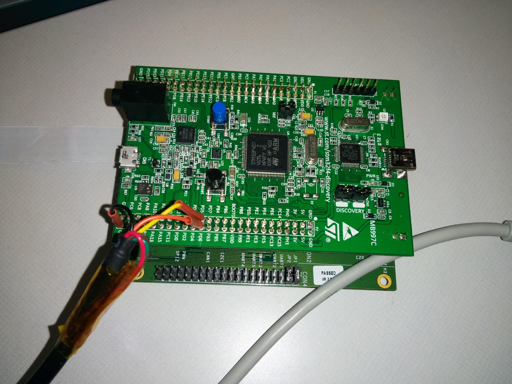

ROS 2.0 NuttX prototype
-------------

This repository prototypes ROS 2.0 for embedded systems using NuttX, Tinq and the STM32F4 IC.

- [Milestones](#milestones)
- [Hardware](#hardware)
    + [STM32F4Discovery](#stm32f4discovery-board)
    + [STM3240G-eval](#stm3240g-eval)
- [Setting it up](#setting-it-up)
    + [Installing menuconfig](#installing-menuconfig)
    + [Selecting a configuration](#selecting-a-configuration)
    + [Building](#building)
    + [Programming](#programming)
    + [Modifying NuttX](#modifying-nuttx)
    + [Debugging](#debugging)
    + [Rebasing NuttX](#Rebasing-nuttx)
    + [Memory inspection](#memory-inspection)
- [Running in Linux](#running-in-linux)
- [Communication](#communication)

### Milestones

- [x] Quick overview/understand fo the OMG DDS standart 
- [x] Evaluate different Open Source DDS implementations and select one meant for embedded devices (Tinq selected)
- [x] Prototype with FreeRTOS (discarded)
- [x] Prototype with Riot (discarded)
- [x] Prototype with NuttX (current prototype)
- [x] Use the network stack to create a simple UDP/IP example over Ethernet
- [x] NSH (NuttX Shell) infraestructure set up
- [x] Adjust DDS interfaces to match with NuttX (pseudo-POSIX)
- [x] DDS compiling and linking on top of NuttX
- [x] Code small enough to fit in RAM and ROM (112 KB and 1 MB respectively)
- [x] DDS chat application running
- [x] DDS Debug Shell available
- [ ] Tinq-embedded <-> Tinq Desktop interoperability (DDS embedded - DDS Desktop)
- [ ] Tinq-embedded <-> OpenSplice Desktop interoperability 
- [ ] RCL construction
- [ ] Real Time assessment
- [ ] Hardware frontier


###Hardware
####STM32F4Discovery board
Initially we kicked off the prototype with the `STM32F4Discovery board` together with the `STM32F4-BB` (this daugher board provides Ethernet). The board is connected to the computer using USB. This connection is used to power up the board, program and debug (through STLINK). `PD5`, `PD6` and `GND` are used as the serial connection (for development and debugging purposes, NSH, etc). An Ethernet cable is connected from the `STM32F4-BB` to the working station.



The size of Tinq and NuttX together made us switch into a board with more capacity the STM3240G-eval.

####STM3240G-eval 


The STM3240G-eval board includes additional 2 MB SRAM. In order to set it up, connect the USB (flashing purposes, ST-Link), the Ethernet cable, the power connector and finally a 3.3V USB to serial cable:


The `TX`, `RX` and `GND` signals should be connected to `CN4` pins `36`, `35` and `39` respectively.


###Setting it up

##### Installing `menuconfig`
```bash
git clone http://ymorin.is-a-geek.org/git/kconfig-frontends
cd kconfig-frontends/
sudo apt-get install gperf
sudo apt-get install flex
sudo apt-get install bison
sudo apt-get install libncurses5-dev
./bootstrap
./configure
make
sudo make install
sudo /sbin/ldconfig -v
```

##### Selecting a configuration
For Tinq the one you need to use is:
```bash
cd nuttx/tools
./configure stm3240g-eval/dds
```
(alternatively if you work with the STM32F4Discovery board do a `./configure stm32f4discovery/dds
`)

#####Building

```bash
cd nuttx/
make 
```


#####Programming
To program the board:
```bash
make program
```

The output should look like:
```bash
make program
../tools/openocd/bin/openocd -f board/stm32f4discovery.cfg -c "init" -c "reset halt" -c "flash write_image erase nuttx.bin 0x08000000 bin" -c "verify_image nuttx.bin 0x8000000; reset run; exit"
Open On-Chip Debugger 0.9.0-dev-00112-g1fa24eb (2014-08-19-11:23)
Licensed under GNU GPL v2
For bug reports, read
    http://openocd.sourceforge.net/doc/doxygen/bugs.html
Info : The selected transport took over low-level target control. The results might differ compared to plain JTAG/SWD
adapter speed: 1000 kHz
adapter_nsrst_delay: 100
srst_only separate srst_nogate srst_open_drain connect_deassert_srst
Info : clock speed 1000 kHz
Info : STLINK v2 JTAG v17 API v2 SWIM v0 VID 0x0483 PID 0x3748
Info : using stlink api v2
Info : Target voltage: 3.242300
Info : stm32f4x.cpu: hardware has 6 breakpoints, 4 watchpoints
target state: halted
target halted due to debug-request, current mode: Thread 
xPSR: 0x01000000 pc: 0x080004b0 msp: 0x2000ce18
auto erase enabled
Info : device id = 0x10016413
Info : flash size = 1024kbytes
target state: halted
target halted due to breakpoint, current mode: Thread 
xPSR: 0x61000000 pc: 0x20000042 msp: 0x2000ce18
wrote 655360 bytes from file nuttx.bin in 23.653700s (27.057 KiB/s)
target state: halted
target halted due to breakpoint, current mode: Thread 
xPSR: 0x61000000 pc: 0x2000002e msp: 0x2000ce18
verified 646286 bytes in 5.552209s (113.673 KiB/s)
make: [program] Error 1 (ignored)
```

##### Modifying NuttX
To program the board:
```bash
make program
```

#####Debugging

```bash
cd nuttx/
make gdb_server
```
In another terminal (same directory):
```bash
make gdb
```


##### Rebasing NuttX
This prototype relies heavily on NuttX. It's recommended to rebase the code frequently with the master branch of NuttX git://git.code.sf.net/p/nuttx/git. The following steps show picture how to do it:
```bash
git remote add nuttx git://git.code.sf.net/p/nuttx/git
git fetch nuttx
git checkout master
git rebase nuttx/master
```

##### Memory inspection
We can review the memory consumed by the compiled image by:
```bash
cd nuttx
source tools/showsize.sh nuttx
```

###Running in Linux
NuttX includes a simulator that allows to run the applications (with some resctrictions, refer to [nuttx/configs/sim/README.txt](nuttx/configs/sim/README.txt)) directly in Linux. A simple setup can be achieved through:
```
cd nuttx
make distclean # this is an important step to clean previous builds
cd tools
./configure.sh sim/nsh # make sure you have all the requirements in your Linux machine before compiling (e.g. zlib installed, ...)
cd -
make
./nuttx # you should see the NuttX shell ;)
```

---

*IGMPv2*

NuttX supports only IGMPv2 thereby in order to put force your Linux machine in this mode the following should
be done:
```bash

sudo bash
echo "2" > /proc/sys/net/ipv4/conf/eth0/force_igmp_version
```
If you wish to set if to the default value:
```bash
sudo bash
echo "0" > /proc/sys/net/ipv4/conf/eth0/force_igmp_version
```

---


### Communication
- [development discussion](https://github.com/brunodebus/tinq-core/issues/7)


